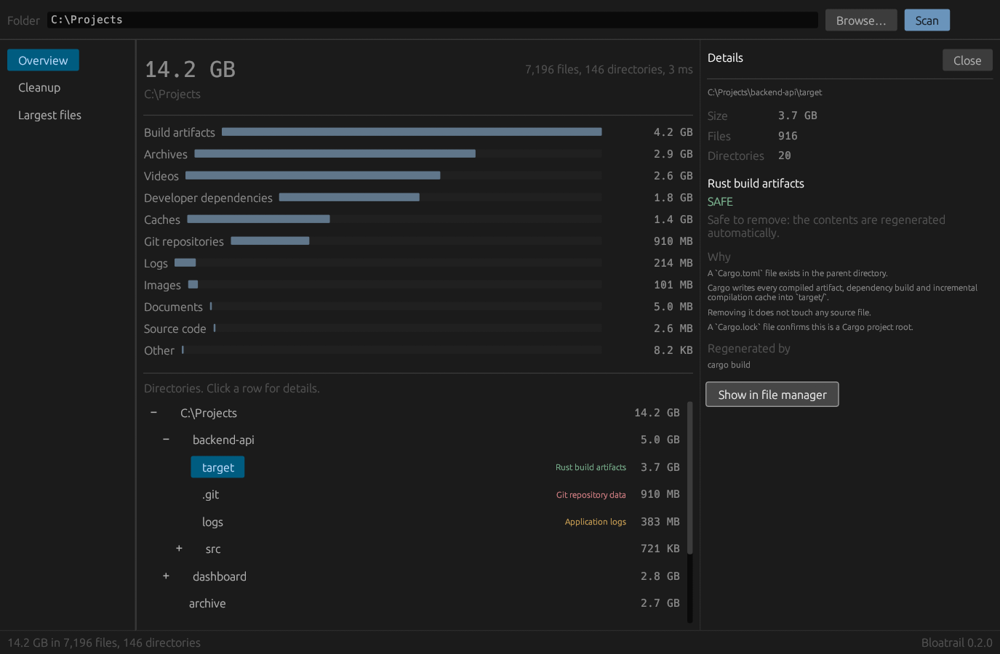
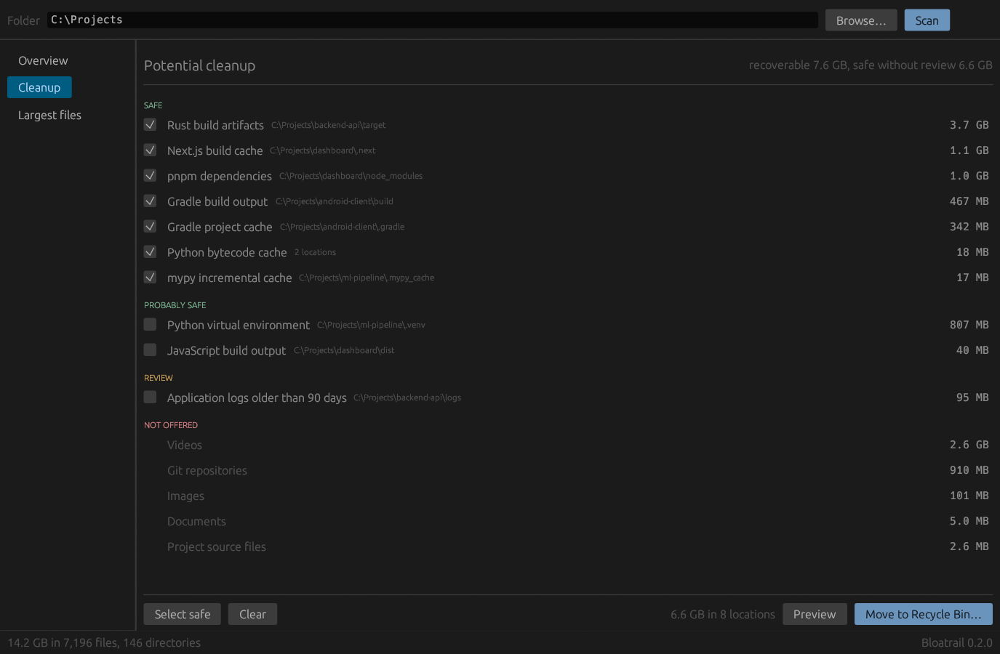
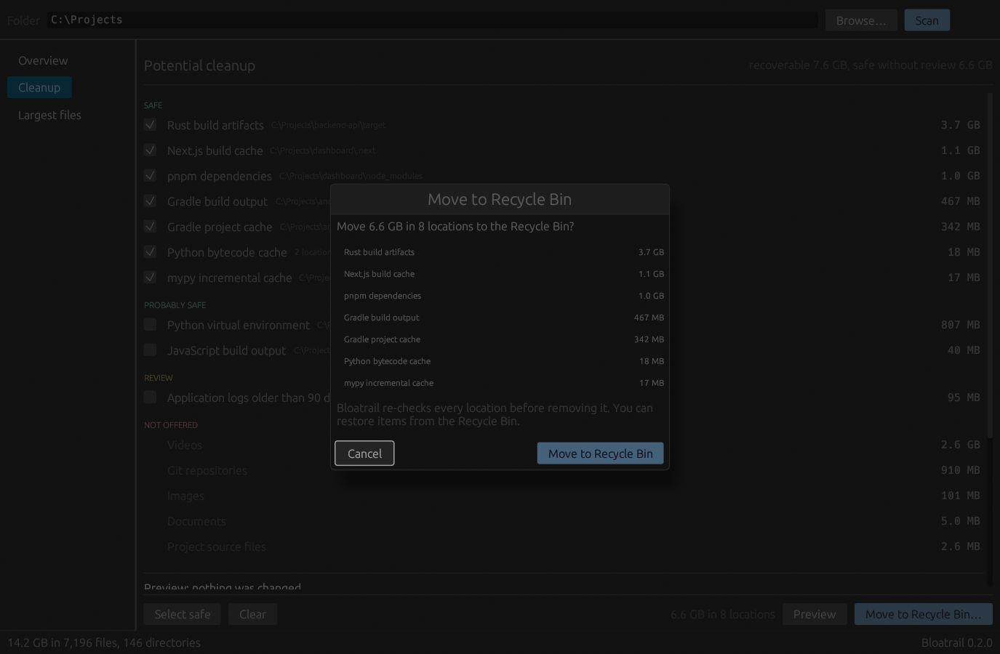
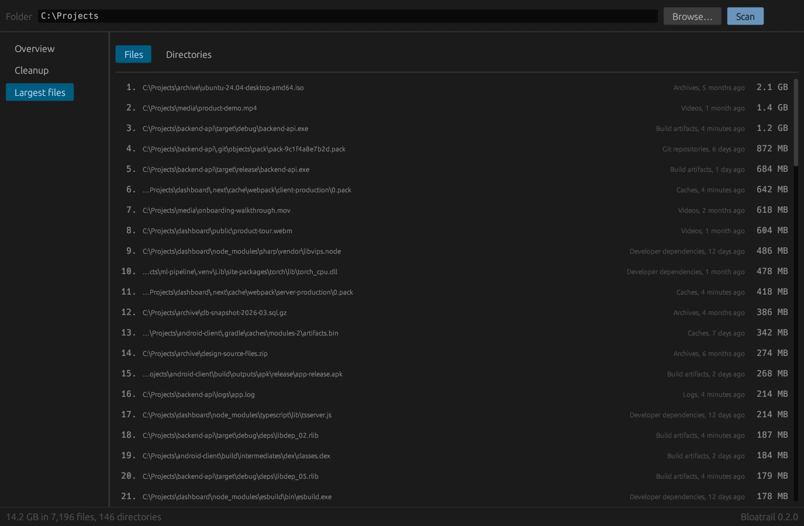

# Bloatrail

**Find out where your disk space actually went.**

Bloatrail is a developer-aware disk analyser written in Rust, with a command-line
tool and a native desktop app. It identifies dependencies, build artifacts,
caches, Git data and container storage, explains why each one sits on your disk,
and offers to remove the parts your build tools can recreate.



> Every screenshot and sample output on this page comes from a synthetic project
> folder built for the purpose. None of it is a real machine, and no benchmark
> figures are quoted anywhere in this repository.

---

## Why Bloatrail?

Any disk analyser sorts directories by size:

```
node_modules   6.2 GB
target         4.8 GB
.git           1.7 GB
```

That list names the space and tells you nothing about which entry you can
delete. `du` treats all three the same. Bloatrail adds the column that decides
what you do next:

```
$ bloatrail tree C:\Projects --depth 2

C:\Projects                                              14.2 GB

├── backend-api\                                          5.0 GB   ████████████████
│   ├── target\                                           3.7 GB   Rust build artifacts
│   ├── .git\                                             910 MB   Git repository data (kept)
│   ├── logs                                              383 MB   Application logs
│   └── src\                                              721 KB   █░░░░░░░░░░░░░░░
├── dashboard\                                            2.8 GB   █████████░░░░░░░
│   ├── .next\                                            1.1 GB   Next.js build cache
│   ├── node_modules\                                     1.0 GB   pnpm dependencies
│   ├── public\                                           633 MB   █████████░░░░░░░
│   ├── dist\                                              40 MB   JavaScript build output
│   └── src\                                              864 KB   █░░░░░░░░░░░░░░░
├── ml-pipeline\                                          841 MB   ███░░░░░░░░░░░░░
│   ├── .venv\                                            807 MB   Python virtual environment
│   ├── .mypy_cache\                                       17 MB   mypy incremental cache
│   └── __pycache__\                                       11 MB   Python bytecode cache
├── android-client\                                       809 MB   ███░░░░░░░░░░░░░
│   ├── build\                                            467 MB   Gradle build output
│   └── .gradle\                                          342 MB   Gradle project cache
└── marketing\                                            5.0 MB   █░░░░░░░░░░░░░░░
    └── target                                            2.0 MB   Directory named `target` with no project context
```

Look at the last two lines. Both directories are called `target`. One sits
beside a `Cargo.toml` and gets called regenerable build output. The other sits
in a marketing folder and keeps its contents.

Ask about either one:

```
$ bloatrail explain C:\Projects\backend-api\target

C:\Projects\backend-api\target
Size: 3.7 GB
916 files, 20 directories

Detected as:
Rust build artifacts (Rust)
category: Build artifacts · confidence: HIGH

Why:
A `Cargo.toml` file exists in the parent directory.
Cargo writes every compiled artifact, dependency build and incremental compilation cache into `target/`.
Removing it does not touch any source file.
A `Cargo.lock` file confirms this is a Cargo project root.

Cleanup:
SAFE
Safe to remove: the contents are regenerated automatically.

Regenerated by:
  cargo build

Remove it with:
  bloatrail clean C:\Projects\backend-api\target --dry-run

Recoverable:
3.7 GB
```

```
$ bloatrail explain C:\Projects\marketing\target

Detected as:
Directory named `target` with no project context
category: Other · confidence: LOW

Why:
The name matches a Rust build directory, but no `Cargo.toml` was found in the parent directory.
Bloatrail will not treat this as regenerable build output.

Cleanup:
REVIEW

Recoverable:
nothing; this is not disposable storage
```

The name matched twice and the verdict followed the evidence. Every rule in
Bloatrail works this way: a directory earns its classification from the project
around it, never from its name alone.

---

## The desktop app

`bloatrail-gui` runs the same engine behind a window. The two frontends share
the scanner, the classifier and the safety layer, so they cannot disagree about
what is safe.

### Review what you would remove

Groups are ordered by how confident Bloatrail is, and the checkboxes start
empty. **Select safe** ticks the `SAFE` groups; nothing else is ever ticked for
you.



### Confirm before anything moves

The dialog restates the exact scope, Cancel holds focus, and Escape closes it.
Removals from the app go to the Recycle Bin. Permanent deletion lives in the
CLI, behind a flag you have to type.



### Find the individual files

Each row carries its category and its age, because the age answers the question
the size raises: is this still in use?



Build the app with:

```bash
cargo build --release --features gui
```

---

## Installation

Bloatrail is not on any package registry yet. Build it from source:

```bash
git clone https://github.com/Juuzoe/bloatrail
cd bloatrail
cargo build --release                    # the CLI
cargo build --release --features gui     # the CLI and the desktop app
```

The binaries land in `target/release/`. Copy them onto your `PATH`, or install
the CLI with `cargo install --path .`.

Requires Rust 1.82 or newer. Nothing else: the Docker integration is optional
and skips itself when Docker is absent.

---

## Usage

```bash
bloatrail scan                 # where did the space in this directory go?
bloatrail scan ~/Developer     # ...or somewhere else
bloatrail tree ~/Developer     # annotated directory tree
bloatrail clean --dry-run      # what could be removed, and why
bloatrail clean                # review, select, confirm, remove
bloatrail explain ./target     # what is this, exactly?
bloatrail largest --files      # biggest files, with categories and ages
bloatrail duplicates           # byte-identical files
bloatrail doctor               # read-only health check
bloatrail diff                 # what changed since the last scan
bloatrail config --example     # a starter configuration file
bloatrail completions <shell>  # bash, zsh, fish, powershell or elvish
```

Ctrl+C during a scan stops it cleanly. You keep the totals for everything
reached so far, labelled as partial, and a cancelled scan is never recorded as a
`diff` baseline. A second Ctrl+C aborts.

### Global options

| Option | Meaning |
| --- | --- |
| `-d`, `--depth <N>` | Levels of nesting to display (default `2`) |
| `-n`, `--top <N>` | Rows in ranked output (default `10`) |
| `--min-size <SIZE>` | Hide entries smaller than this in `tree` and `largest`, and use it as a floor for `duplicates`. Never changes the totals |
| `-j`, `--threads <N>` | Worker threads (default: one per core) |
| `-x`, `--exclude <PATTERN>` | Skip matching paths; repeatable |
| `--include-hidden` | Traverse dot-*directories* that are not developer storage. Hidden files are always counted |
| `--follow-symlinks` | Descend into links and Windows junctions |
| `--same-filesystem` | Do not cross filesystem boundaries |
| `--json` | Machine-readable output |
| `--no-color` | Disable colour (`NO_COLOR` is honoured too) |
| `--ascii` | ASCII box drawing instead of Unicode |
| `--no-progress` | Do not draw live scan progress |
| `--config <FILE>` | Use a specific configuration file |

### Per-command options

| Command | Options |
| --- | --- |
| `scan` | `--tree`, `--reclaim`, `--no-record` |
| `tree` | `--max-children <N>` (default 12), `--no-bars` |
| `clean` | `--dry-run`, `--all`, `--safe`, `--select <SPEC>`, `-y`/`--yes`, `--permanent` |
| `largest` | `--files`, `--dirs` |
| `duplicates` | `--min-file-size <SIZE>` (default `1MB`) |
| `doctor` | `--no-docker`, `--show-skipped` |
| `diff` | `--stored`, `--no-record` |
| `config` | `--example`, `--path`, `--init` |

### Sizes next to what you can get back

```
$ bloatrail scan C:\Projects --reclaim

Reclaimable storage

  Directory                                             Size   Reclaimable  Confidence
  C:\Projects\backend-api\target                      3.7 GB        3.7 GB        HIGH
  C:\Projects\dashboard\.next                         1.1 GB        1.1 GB        HIGH
  C:\Projects\dashboard\node_modules                  1.0 GB        1.0 GB        HIGH
  C:\Projects\backend-api\.git                        910 MB             —       NEVER
  C:\Projects\ml-pipeline\.venv                       807 MB        807 MB     CERTAIN
  C:\Projects\android-client\build                    467 MB        467 MB        HIGH
  C:\Projects\backend-api\logs                        383 MB         95 MB      MEDIUM
  C:\Projects\android-client\.gradle                  342 MB        342 MB        HIGH
  C:\Projects\dashboard\dist                           40 MB         40 MB      MEDIUM
```

Sorting by size puts `.git` near the top. The second column is what keeps you
from acting on that.

---

## Cleanup safety

`bloatrail clean` follows one order of operations, always:

```
detect → explain → classify → preview → select → confirm → remove
```

```
$ bloatrail clean C:\Projects --dry-run

Potential cleanup

SAFE
✓ [1] Rust build artifacts                     3.7 GB
      C:\Projects\backend-api\target
✓ [2] Next.js build cache                      1.1 GB
      C:\Projects\dashboard\.next
✓ [3] pnpm dependencies                        1.0 GB
      C:\Projects\dashboard\node_modules
✓ [4] Gradle build output                      467 MB
      C:\Projects\android-client\build
✓ [5] Gradle project cache                     342 MB
      C:\Projects\android-client\.gradle
✓ [6] Python bytecode cache                     18 MB
      2 locations
✓ [7] mypy incremental cache                    17 MB
      C:\Projects\ml-pipeline\.mypy_cache

PROBABLY SAFE
✓ [8] Python virtual environment               807 MB
      C:\Projects\ml-pipeline\.venv
✓ [9] JavaScript build output                   40 MB
      C:\Projects\dashboard\dist

REVIEW
! [10] Application logs older than 90 days      95 MB
      C:\Projects\backend-api\logs

DO NOT AUTO DELETE
× Videos                                       2.6 GB
× Git repositories                             910 MB
× Images                                       101 MB
× Documents                                    5.0 MB
× Project source files                         2.6 MB

Potentially recoverable: 7.6 GB
Safe automatic cleanup:  6.6 GB
```

The `logs` directory is 383 MB. Bloatrail offers 95 MB of it, because that is
the part older than the age threshold, and it says so in the group title.

The guarantees behind that flow:

- **The default is always no.** An empty answer, an unrecognised answer, or
  anything other than `y`/`yes` cancels. A `--select` value that fails to parse
  is an error, never a fallback.
- **`--dry-run` performs no filesystem mutation.** This is structural rather
  than a policy check: the executor returns before any mutating call, and the
  test suite asserts that every file survives a dry run of a plan that would
  otherwise delete them.
- **Non-interactive means read-only.** If stdin is not a terminal and you did
  not pass `--yes` with an explicit selection, `clean` downgrades itself to a
  dry run and says so. Piping Bloatrail into something cannot delete your files.
- **Removals go to the trash** (Recycle Bin, Trash, or the freedesktop trash)
  unless you pass the explicitly named `--permanent`.
- **Plans are re-verified at deletion time.** If the `Cargo.toml` beside a
  `target/` disappeared between the preview and the confirmation, the removal is
  abandoned. So is any path that is not absolute, contains `..`, lies outside
  the scanned root, resolves outside it through a symlink, passes through
  `.ssh`/`.gnupg`/`.aws`/`.kube`, or is a filesystem root or home directory.
- **Anything below `High` confidence is searched for secrets first.** A `Review`
  directory holding a `.pem`, `.env`, wallet or database file is refused, with
  the reason printed.

Bloatrail never removes user documents, source code, `.git` directories,
databases, credentials, SSH keys, unknown files, or arbitrary project folders.

### Classification vocabulary

Three orthogonal questions, three separate types:

| Question | Type | Values |
| --- | --- | --- |
| What is it? | `Category` | `SourceCode`, `Dependency`, `BuildArtifact`, `Cache`, `PackageCache`, `ContainerData`, `GitData`, `VirtualMachine`, `Log`, `Temporary`, `Download`, `Archive`, `Video`, `Image`, `Audio`, `Document`, `Application`, `Game`, `System`, `Unknown` |
| How sure are we? | `Confidence` | `Low`, `Medium`, `High`, `Certain` |
| May it be removed? | `CleanupSafety` | `Safe`, `ProbablySafe`, `Review`, `Dangerous`, `NeverDelete` |

A fourth type, `Reclaim`, answers how much: `All`, `OlderThan { days }`,
`External` (reclaim through the owning tool) or `None`. It lets Bloatrail say
"Downloads: 14.2 GB, 6.3 GB reclaimable" instead of pretending the whole folder
is disposable.

Being certain something is a `.git` directory and refusing to delete it sit
together without tension: confidence and safety are independent by design.

---

## Supported developer ecosystems

| Ecosystem | Recognised by | Detected storage |
| --- | --- | --- |
| **Rust** | `Cargo.toml`, `Cargo.lock` | `target/`, `~/.cargo/registry`, `~/.cargo/git`, `~/.rustup` |
| **JavaScript / TypeScript** | `package.json`, `package-lock.json`, `pnpm-lock.yaml`, `yarn.lock`, `bun.lock(b)` | `node_modules/`, `.next/`, `.nuxt/`, `.turbo/`, `.parcel-cache/`, `.svelte-kit/`, `.astro/`, `.angular/`, `.vite/`, `dist/`, `out/`, `coverage/`, `.yarn/`, npm/pnpm/yarn/bun caches |
| **Python** | `pyproject.toml`, `requirements.txt`, `setup.py`, `poetry.lock`, `Pipfile`, `pyvenv.cfg` | `__pycache__/`, `.pytest_cache/`, `.mypy_cache/`, `.ruff_cache/`, `.tox/`, `.nox/`, `.venv/`, `site-packages/`, `*.egg-info`, pip/uv/Poetry/Conda caches |
| **JVM** | `pom.xml`, `build.gradle(.kts)`, `gradlew` | `target/` (Maven), `build/`, `out/`, `.gradle/`, `~/.m2/repository`, `~/.gradle/caches` |
| **.NET** | `*.csproj`, `*.fsproj`, `*.sln` | `bin/`, `obj/`, `.vs/`, `packages/`, `~/.nuget/packages` |
| **Go** | `go.mod`, `go.sum` | `vendor/`, `bin/`, `~/go/pkg/mod`, `~/.cache/go-build` |
| **C / C++** | `CMakeLists.txt`, `Makefile`, `meson.build`, `configure` | `build/`, `cmake-build-*/`, `CMakeFiles/`, `.ccache/` |
| **Swift / Xcode** | `Package.swift`, `*.xcodeproj`, `Podfile` | `.build/`, `Pods/`, `DerivedData/`, `xcuserdata/`, iOS DeviceSupport, simulators |
| **Zig / Nim** | `build.zig`, `build.zig.zon` | `zig-out/`, `zig-cache/`, `.zig-cache/`, `nimcache/` |
| **Cloudflare Workers** | `wrangler.toml`, `wrangler.json(c)` | `.wrangler/`, held at `ProbablySafe` because it holds local D1 and KV state |
| **Others** | `Gemfile`, `composer.json`, `pubspec.yaml`, `mix.exs`, `*.cabal`, `*.tf` | `vendor/`, `deps/`, `_build/`, `dist-newstyle/`, `.stack-work/`, `.dart_tool/`, `.terraform/`, `elm-stuff/` |
| **Unity** | `Assets/` and `ProjectSettings/` together | `Library/`, `Temp/`, `Obj/` |
| **IDEs** | | `.idea/`, `.vscode/`, `.vs/`, `.fleet/`, `.zed/`, JetBrains caches, VS Code caches |
| **Version control** | | `.git/`, `.hg/`, `.svn/`, `.jj/`, measured and never offered |
| **Containers** | | Docker Desktop data, `/var/lib/docker`, Podman storage, `overlay2/`, BuildKit cache |

Home-directory locations resolve per platform: `%LOCALAPPDATA%` and `%APPDATA%`
on Windows, `~/Library/...` on macOS, XDG paths on Linux.

Adding an ecosystem means writing one `Detector` and appending it to the
registry in [`src/detectors/mod.rs`](src/detectors/mod.rs). Nothing else in the
codebase changes.

---

## Docker

Bloatrail reports Docker usage and never touches it. It asks the Docker CLI what
it is using and points at the official prune commands:

```
Docker reclaimable storage

  Images             8.4 GB       5.1 GB reclaimable
  Containers         750 MB       600 MB reclaimable
  Volumes            9.2 GB       1.1 GB reclaimable
  Build cache        3.1 GB       3.1 GB reclaimable

  docker image prune -a
  docker builder prune
  docker volume prune
      volumes can hold databases and other state you have no second copy of

Bloatrail never deletes Docker's files directly.
```

Docker missing, stopped, or slower than five seconds to answer all produce the
same result: a note, and every other command carries on. Docker is never a
runtime requirement.

---

## Duplicates

```bash
bloatrail duplicates ~/Downloads
```

The search is staged so that almost nothing gets read:

1. **Group by size.** Different sizes cannot be identical, and size comes free
   from the directory walk.
2. **Discard unique sizes.** This removes most files without reading a byte.
3. **Partial hash.** BLAKE3 over the first and last 16 KiB of the survivors;
   files under 32 KiB are read in full at this stage, which is what makes the
   next step safe to skip for them.
4. **Full hash.** Only groups that still collide are read end to end.

A reported duplicate is a byte-for-byte match. Bloatrail never deletes
duplicates: which copy should survive is a judgement only you can make.

---

## Health check

```
$ bloatrail doctor C:\Projects

BLOATRAIL
Bloatrail Doctor

WARN  4.2 GB of build artifacts can be regenerated
      see `bloatrail clean --dry-run`
WARN  The volume holding this path is 88% full (56.1 GB free)
      run `bloatrail clean --dry-run` to see what can be recovered
WARN  1 file larger than 2.0 GB (2.1 GB in total)
      `bloatrail largest --files` lists them
INFO  Rust storage accounts for 3.7 GB
INFO  Node.js storage accounts for 2.2 GB

Possible recovery: 4.2 GB
```

`doctor` reads and reports. It changes nothing.

---

## Configuration

Optional. Every setting has a defensible default, and command-line flags always
win.

```bash
bloatrail config            # what is in effect right now
bloatrail config --path     # where the file would be read from
bloatrail config --example  # a commented starter file
bloatrail config --init     # write that starter file
```

```toml
# ~/.config/bloatrail/config.toml                       (Linux)
# ~/Library/Application Support/bloatrail/config.toml    (macOS)
# %APPDATA%\bloatrail\config.toml                        (Windows)

exclude = ["/mnt/archive", "~/VMs", "*.iso"]
min_size = "1MB"
threads = 8
follow_symlinks = false
depth = 2
top = 10
stale_days = 90
```

Setting `BLOATRAIL_HOME` overrides both the configuration and scan-history
locations, which is how the test suite stays out of your real state.

---

## JSON output

Every command accepts `--json`. Dedicated types in
[`src/output/json.rs`](src/output/json.rs) define the schema, kept separate from
the internal engine types, and every document carries `schema_version`.

```bash
bloatrail scan --json   | jq '.categories[] | select(.bytes > 1e9)'
bloatrail clean --json  | jq '.groups[] | select(.safety == "safe") | .title'
bloatrail doctor --json | jq '.findings[] | select(.severity == "warn")'
```

```json
{
  "schema_version": 1,
  "root": "C:\\Projects",
  "totals": { "bytes": 15195025270, "files": 7196, "directories": 146 },
  "categories": [
    { "category": "build_artifact", "label": "Build artifacts", "bytes": 4512402003, "files": 1458 }
  ],
  "tree": {
    "path": "C:\\Projects\\backend-api\\target",
    "bytes": 3980897446,
    "reclaimable": 3980897446,
    "truncated": true,
    "detection": {
      "category": "build_artifact",
      "technology": "Rust",
      "confidence": "high",
      "cleanup": "safe",
      "reason": "Rust build artifacts",
      "regenerated_by": "cargo build"
    }
  }
}
```

---

## Performance

The scanner is a parallel depth-first traversal built on Rayon. Each directory
reads its own entries and hands its subdirectories to the work-stealing pool.
Because the recursion returns aggregated values, directory totals are computed
on the way back up with no second pass and no shared mutable tree.

Three decisions keep it fast and bounded:

- **Collapsed subtrees.** A directory classified as opaque (`node_modules`,
  `target`, `.git`) is measured exactly, and its children are neither retained
  nor classified. On a developer machine that is the difference between a
  hundred thousand retained nodes and a million.
- **Arena-allocated tree.** Nodes store their own name and a parent index;
  paths are reconstructed on demand. A `PathBuf` per node would repeat every
  ancestor's bytes at every level.
- **Allocation-free rejection.** "Largest files" is one shared bounded heap
  behind an atomic threshold, so a file that will not make the list costs one
  relaxed load and no allocation. Classification dispatches on the directory
  name through a hash table, so a directory no rule cares about costs one hash
  lookup. Marker files come from the directory listing that already happened,
  which is why project context costs zero extra syscalls.

Benchmarks live in [`benches/`](benches) and run on Criterion:

```bash
cargo bench --bench scanner          # end-to-end traversal throughput
cargo bench --bench classification   # per-directory classification cost
```

[`docs/BENCHMARKS.md`](docs/BENCHMARKS.md) explains how to record results on
your own hardware. **No performance figures appear in this repository**, because
none have been measured on a machine you could compare against.

### Known limits

- Hard-link deduplication is Unix-only. Windows exposes a file's link count only
  through an open handle, and one `CreateFile` per file is not a trade worth
  making. On Windows, hard-linked files count once per name.
- `--same-filesystem` uses the device id on Unix. On Windows it compares the
  volume prefix and refuses to traverse reparse points, which gives the same
  practical guarantee without a syscall per directory.
- Sizes are apparent sizes, not on-disk allocation. Sparse files and compressed
  filesystems report more than they physically occupy. The throughput figure is
  therefore "bytes analysed per second", not disk bandwidth.
- Traversal stops at 400 levels of nesting. The walk is recursive, so unbounded
  depth means an unbounded stack, and a stack overflow aborts the process
  instead of raising an error. Anything deeper is reported as skipped. No real
  filesystem comes close.
- Bare Git repositories (a `HEAD`/`objects`/`refs` layout not named `.git`) are
  measured as ordinary directories. Recognising them would mean a structural
  check on every directory in the scan, for a classification that would be
  `NeverDelete` either way.

---

## Architecture

```
src/
├── main.rs              CLI entry point: parse, dispatch, report errors
├── bin/gui/             the desktop app (feature `gui`): state, views, palette
├── lib.rs               library root and architecture notes
├── units.rs             ByteSize and human-readable formatting
├── error.rs             domain errors (thiserror); the binary adds anyhow context
├── pattern.rs           the exclusion glob matcher
├── timefmt.rs           minimal date and duration formatting
├── config.rs            defaults < config file < command line
├── history.rs           scan snapshots and `diff`
├── docker.rs            Docker CLI integration, with a timeout
├── duplicates.rs        staged duplicate detection
├── doctor.rs            read-only health checks
├── platform/            where things live, disk capacity, protected paths
│   ├── windows.rs       GetDiskFreeSpaceExW, reparse points, volume identity
│   ├── unix.rs          statvfs, symlinks, device ids
│   └── fallback.rs      neutral behaviour elsewhere
├── analysis/            the vocabulary and the rules engine
│   ├── domain.rs        Category, Technology, Confidence, CleanupSafety, Reclaim
│   ├── context.rs       DirContext and the Markers bitset
│   ├── engine.rs        detector registry, dispatch and scoring
│   ├── categorize.rs    file-extension fallback
│   ├── sensitive.rs     keys, credentials, wallets, databases
│   └── reclaim.rs       reclaimability scoring
├── detectors/           one module per ecosystem
├── scanner/             the parallel walk
│   ├── walker.rs        traversal, collapse, hard links, symlink loops
│   ├── tree.rs          the node arena and the bounded top-N heap
│   └── progress.rs      live progress on a dedicated thread
├── cleanup/             planner → safety guard → executor
├── output/              rendering; imported by nothing below it
└── cli/                 one module per subcommand
```

The layering runs one way. Nothing in `scanner`, `analysis` or `cleanup` knows
that a terminal exists, which is what makes the engine testable without
capturing output and usable as a library:

```rust
use bloatrail::{analysis::Classifier, cleanup::CleanupPlan, platform::KnownPaths, scanner};

let classifier = Classifier::with_default_detectors();
let known = KnownPaths::discover();
let result = scanner::scan(&scanner::ScanOptions::new("."), &classifier, &known)?;

let plan = CleanupPlan::from_scan(&result);
println!("recoverable: {}", plan.recoverable());
```

---

## Development

```bash
cargo build --release --features gui
cargo test                                             # unit + integration
cargo clippy --all-targets --all-features -- -D warnings
cargo fmt --all -- --check
cargo bench
```

The test suite covers byte formatting, glob matching, category classification,
technology detection, exclusion rules, tree aggregation, duplicate grouping and
configuration merging. The safety rules get the heaviest coverage, including a
test proving a dry run leaves every file in place and one proving a stale plan
cannot delete a directory that stopped looking like build output.

Unix-only behaviour (hard links, symlink loops, permission-denied recovery) is
covered by `#[cfg(unix)]` tests that create real links and real unreadable
directories.

The desktop app tests itself: set `BLOATRAIL_SHOT_DIR` and `BLOATRAIL_SHOT_SCAN`
and it drives its own UI end to end, writing a PNG of each view before exiting.
The screenshots on this page were produced that way.

---

## Contributing

Contributions are welcome. The most valuable ones are new detectors: if
Bloatrail does not recognise something that eats your disk, that is a gap worth
closing.

A new detector is one file:

```rust
pub struct MyToolCache;

static TRIGGERS: &[Trigger] = &[Trigger::Name(".mytool-cache")];

impl Detector for MyToolCache {
    fn id(&self) -> &'static str { "mytool.cache" }
    fn triggers(&self) -> &'static [Trigger] { TRIGGERS }

    fn detect(&self, ctx: &DirContext<'_>) -> Option<Detection> {
        // Demand corroborating context before claiming anything.
        if !ctx.parent_is_project(Markers::PACKAGE_JSON) {
            return None;
        }
        Some(
            Detection::new(Category::Cache, Confidence::High, CleanupSafety::Safe,
                           "MyTool build cache")
                .with_evidence("Regenerated by the next `mytool build`.")
                .regenerated_by("mytool build")
                .collapsed()
        )
    }
}
```

Add it to `detectors::all()`, then write tests covering the positive case and
the case where the same directory name appears without the supporting context.
A detector that fires on a name alone is a bug.

[CONTRIBUTING.md](CONTRIBUTING.md) has the full guide, including the rules for
touching the cleanup safety layer.

---

## License

MIT. See [LICENSE](LICENSE).
